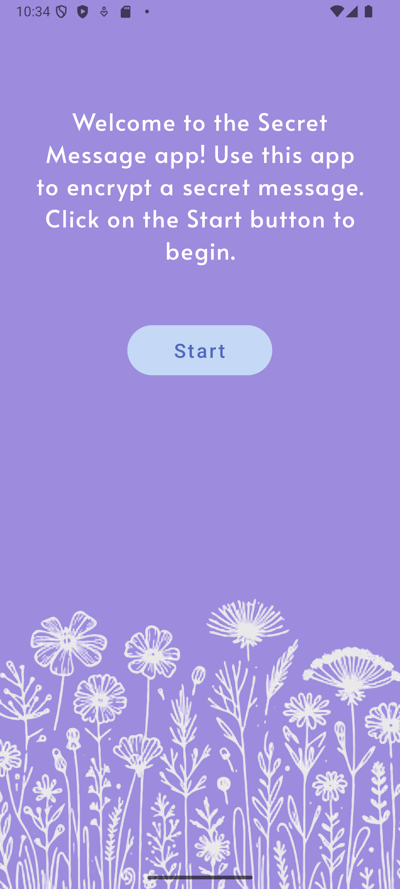
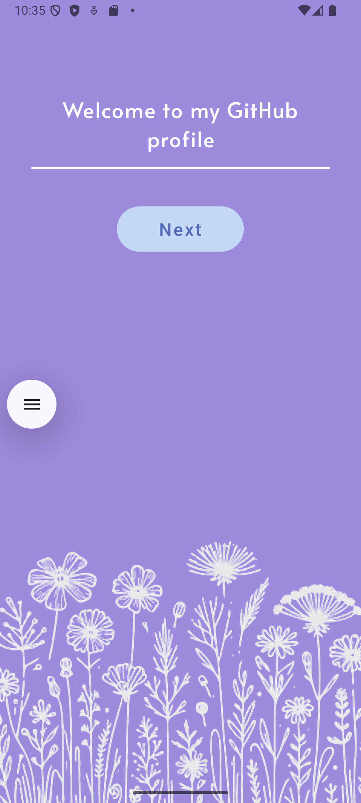
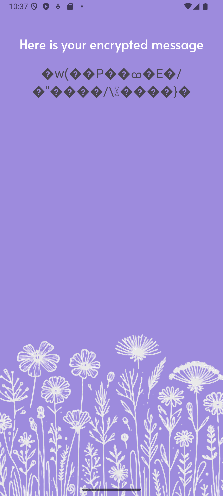

# Secret Message

**Secret Message** is a simple Android application designed to explore basic app structure, navigation, and UI components using modern Android development practices. This project is based on the *O’Reilly Android Development* tutorial and currently implements a two-fragment layout with navigation.

## Features

- Two-screen UI using **Fragments** and **Navigation Component**
- Basic navigation between screens
- Resource organization with strings, colors, and fonts
- AES message encryption using Android Keystore

## Encryption
The app securely encrypts user input using:

- AES/CBC/PKCS7 encryption scheme
- Keys stored in the Android Keystore (hardware-backed when available)
- Randomized Initialization Vector (IV) for every encryption
- Encrypted data is stored internally (e.g., secret.txt)

## Tech Stack

- **Kotlin**
- **Android Jetpack (Fragments, Navigation Component)**
- **Material Design Components**
- **XML-based UI**

## Current Progress

- [x] Created base project structure
- [x] Designed basic UI for two fragments
- [x] Set up navigation graph with fragment transitions
- [x] Message encryption logic
- [ ] UI polish and responsiveness improvements
- [ ] Unit tests and input validation

## Screenshots

<table>
  <tr>
    <td></td>
    <td></td>
    <td></td>
  </tr>
</table>

## License
MIT License – feel free to use, fork, and contribute.
